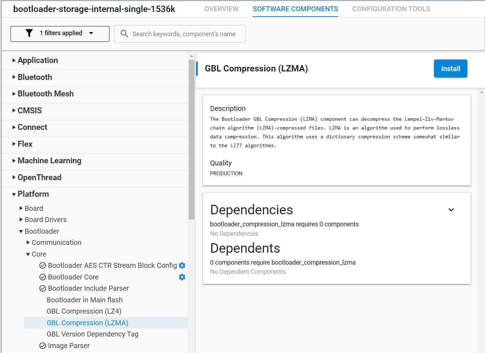

# How to perform Over-The-Air firmware upgrades for Silicon Labs based Matter devices
### Author: [Olav Tollefsen](https://www.linkedin.com/in/olavtollefsen/)

## Introduction

This article shows how to perform Over-The-Air firmware upgrades for Silicon Labs based Matter devices.

This article is based on Silicon Labs Gecko SDK version 4.4.1 with Silicon Labs Matter 2.2.0 extensions.

## Prerequisites

You need to build a "Matter Hub" using the Matter repository on Github (https://github.com/project-chip/connectedhomeip). In addition you need an Open Thread Border Router (OTBR).

I will not go into details on how to prepare the Matter Hub / OTBR here.

### Build the OTA Provider Application

```
cd connectedhomeip
```

```
scripts/examples/gn_build_example.sh examples/ota-provider-app/linux out/provider chip_config_network_layer_ble=false
```

When it’s complete, the OTA provider application is located here ./out/provider/chip-ota-provider-app.

## Download and extract the Silicon Labs Commander CLI tool

Download the Silicon Labs Commander command-line tool:
```
wget https://www.silabs.com/documents/public/software/SimplicityCommander-Linux.zip
```

Unzip it:

```
unzip SimplicityCommander-Linux.zip
```

Extract the application files from an archive file for your platform. This command is for Ubuntu Server 64-bit on Raspberry Pi 4:
```
 tar -xf SimplicityCommander-Linux/Commander-cli_linux_aarch64_1v16p5b1567.tar.bz -C ./
 ```

You can now invoke the commander CLI using this command:
```
 ./commander-cli/commander-cli
```

## Prepare the bootloader for Over-The-Air firmware upgrades

See this article for more details on Creating a Gecko Bootloader for Use in Matter OTA Software Update: https://docs.silabs.com/matter/2.0.0/matter-overview-guides/ota-bootloader

Find the "Bootloader - SoC Internal Storage (single image on 1536kB device)" example project and create a new project from it. This bootloader is for the Silicon Labs xG24-DK2601B EFR32xG24 Dev Kit, which has 1536kB Flash.


Open the .slcp file in your bootloader project and select "SOFTWARE COMPONENTS".

Install the "GBL Compression (LZMA)" component under Platform->Bootloader->Core:



Build the bootloader project, find the .s37 image file (under the Binaries folder) and flash it to your Silicon Labs Dev Kit.

## Prepare the application firmware files

You can use any of the Matter example projects as a starting point.

## Prepare the Over-The-Air firmware files

Convert the .s37 firmware file to a GBL file:
```
 ./commander-cli/commander-cli gbl create <output_file>.gbl --app <input_file>.s37
```

Create the OTA firmware file. Make sure the version number you specifiy in the below command is higher than the version currently running in the device. The Vendor Id and Product Id must also match (these values can be found in CHIPProjectConfig.h)
```
 ./commander-cli/commander-cli ota create --type matter --input <input_file>.gbl --vendorid 0xFFF1 --productid 0x8005 --swstring "3.0" --swversion 3 --digest sha256 -o <output_file>.ota
```


https://www.silabs.com/documents/public/user-guides/ug489-gecko-bootloader-user-guide-gsdk-4.pdf

https://community.silabs.com/s/article/Matter-Software-Update-Over-The-Air?language=en_US&t=1710664906672

./chip-tool pairing ble-thread 2 hex:0e080000000000010000000300001535060004001fffe00208a042cc9a280a00110708fdf36817046590c20510afccd781c0454410d47d72663f216706030f4f70656e5468726561642d343339330102439304100b8c32cd8ae1c7f3464b2f95fcd6c8dd0c0402a0f7f8 20202021 3840


./commander-cli/commander-cli gbl create MatterDS18B20OverThread.gbl --app MatterDS18B20OverThread.s37

./commander-cli/commander-cli ota create --type matter --input MatterDS18B20OverThread.gbl --vendorid 0xFFF1 --productid 0x8001 --swstring "2.0" --swversion 2 --digest sha256 -o MatterDS18B20OverThread.ota

./connectedhomeip/out/provider/chip-ota-provider-app -f MatterDS18B20OverThread.ota


./connectedhomeip/out/chip-tool otasoftwareupdaterequestor write default-otaproviders '[{"fabricIndex": 1, "providerNodeID": 1, "endpoint": 0}]' 2 0


./connectedhomeip/out/chip-tool accesscontrol write acl '[{"fabricIndex": 1, "privilege": 5, "authMode": 2, "subjects": [112233], "targets": null}, {"fabricIndex": 1, "privilege": 3, "authMode": 2, "subjects": null, "targets": null}]' 1 0

./connectedhomeip/out/chip-tool otasoftwareupdaterequestor announce-otaprovider 1 0 0
